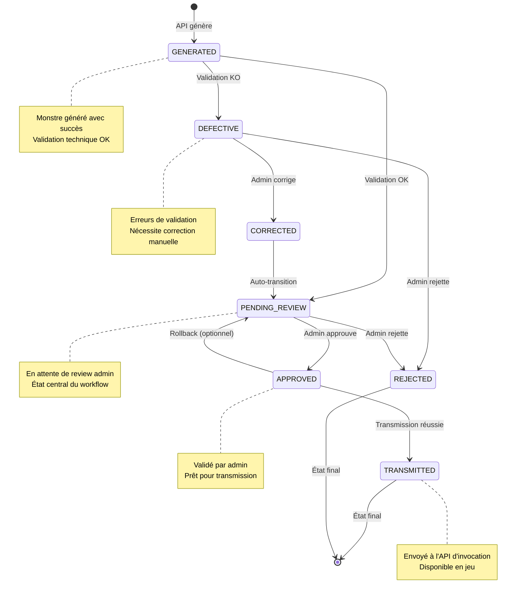
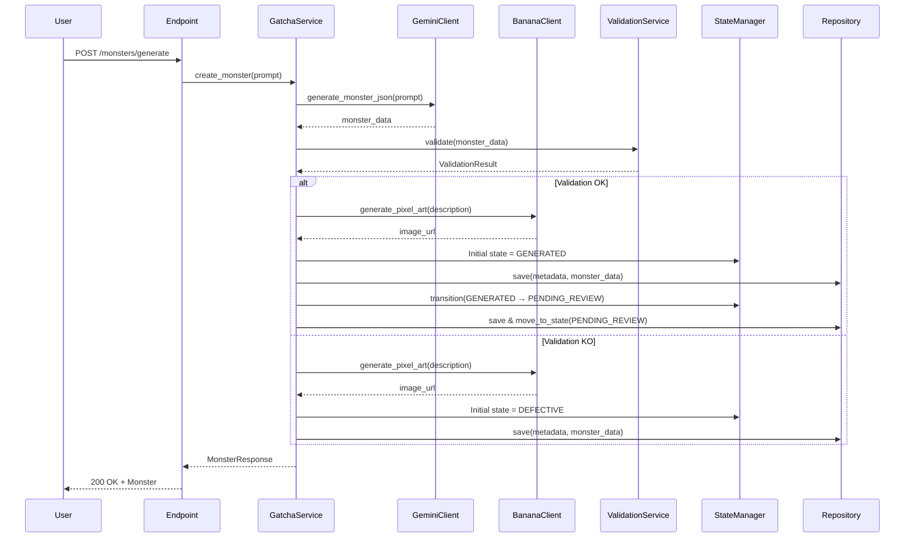
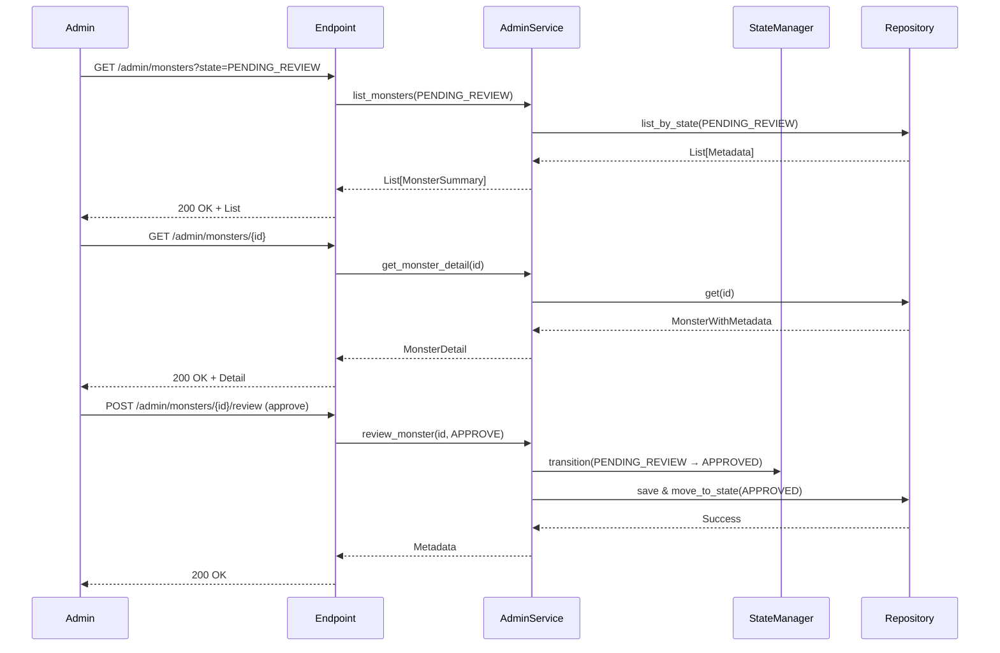
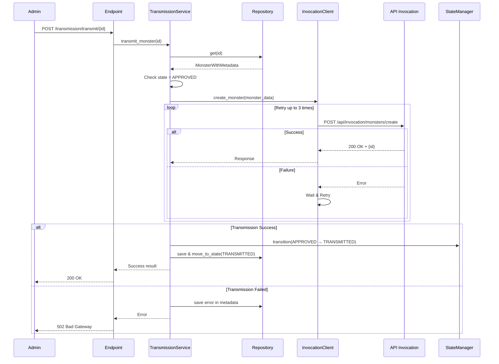

# Architecture et Décisions de Design

## 🏛️ Architecture globale

### Vue d'ensemble du système

```
┌─────────────────────────────────────────────────────────────────┐
│                         Frontend Admin                          │
│                     (À développer plus tard)                    │
└────────────────────────────┬────────────────────────────────────┘
                             │ HTTPS/REST
                             │
┌────────────────────────────▼────────────────────────────────────┐
│                      API Gatcha (FastAPI)                       │
│                                                                  │
│  ┌──────────────┐  ┌──────────────┐  ┌──────────────┐         │
│  │   Endpoints  │  │   Endpoints  │  │   Endpoints  │         │
│  │    Gatcha    │  │    Admin     │  │ Transmission │         │
│  └──────┬───────┘  └──────┬───────┘  └──────┬───────┘         │
│         │                  │                  │                  │
│  ┌──────▼──────────────────▼──────────────────▼───────┐         │
│  │              Service Layer                          │         │
│  │  ┌──────────┐ ┌──────────┐ ┌──────────────┐       │         │
│  │  │  Gatcha  │ │  Admin   │ │ Transmission │       │         │
│  │  │ Service  │ │ Service  │ │   Service    │       │         │
│  │  └────┬─────┘ └────┬─────┘ └──────┬───────┘       │         │
│  │       │            │               │               │         │
│  │  ┌────▼────────────▼───────────────▼──────┐        │         │
│  │  │        Core Services                    │        │         │
│  │  │  ┌──────────┐  ┌────────────────┐      │        │         │
│  │  │  │  State   │  │   Validation   │      │        │         │
│  │  │  │ Manager  │  │    Service     │      │        │         │
│  │  │  └──────────┘  └────────────────┘      │        │         │
│  │  └─────────────────────────────────────────┘        │         │
│  │                                                      │         │
│  │  ┌───────────────────────────────────────────┐      │         │
│  │  │          Data Layer                       │      │         │
│  │  │  ┌──────────────────────────────┐         │      │         │
│  │  │  │    Monster Repository        │         │      │         │
│  │  │  │  (JSON pour l'instant)       │         │      │         │
│  │  │  └──────────────────────────────┘         │      │         │
│  │  └───────────────────────────────────────────┘      │         │
│  │                                                      │         │
│  │  ┌───────────────────────────────────────────┐      │         │
│  │  │          Client Layer                     │      │         │
│  │  │  ┌────────┐ ┌────────┐ ┌──────────────┐  │      │         │
│  │  │  │ Gemini │ │ Banana │ │  Invocation  │  │      │         │
│  │  │  │ Client │ │ Client │ │  API Client  │  │      │         │
│  │  │  └────────┘ └────────┘ └──────────────┘  │      │         │
│  │  └───────────────────────────────────────────┘      │         │
│  └──────────────────────────────────────────────────────┘         │
└────────────────────────────┬────────────────────────────────────┘
                             │
              ┌──────────────┼──────────────┐
              │              │              │
              ▼              ▼              ▼
      ┌──────────┐   ┌──────────┐   ┌──────────┐
      │  Gemini  │   │  Banana  │   │    API   │
      │   API    │   │   API    │   │Invocation│
      └──────────┘   └──────────┘   └──────────┘
```

## 🎨 Patterns de Design utilisés

### 1. Repository Pattern

**Pourquoi ?**
- Abstraction de la couche de persistance
- Facilite les tests (mock du repository)
- Permet de changer de storage sans impacter le code métier
- Centralisé les requêtes de données

**Implémentation :**
```python
class MonsterRepository:
    def save(self, metadata, monster_data) -> bool
    def get(self, monster_id) -> MonsterWithMetadata
    def list_by_state(self, state) -> List[MonsterMetadata]
    def move_to_state(self, monster_id, new_state) -> bool
    def delete(self, monster_id) -> bool
```

### 2. Service Layer Pattern

**Pourquoi ?**
- Séparation entre logique métier et endpoints
- Réutilisabilité du code
- Tests plus simples
- Single Responsibility Principle

**Implémentation :**
- `GatchaService` : Logique de génération
- `AdminService` : Logique d'administration
- `TransmissionService` : Logique de transmission
- `ValidationService` : Logique de validation

### 3. State Machine Pattern

**Pourquoi ?**
- Garantit la cohérence des états
- Empêche les transitions invalides
- Traçabilité complète
- Facilite les rollbacks

**Implémentation :**
```python
class MonsterStateManager:
    VALID_TRANSITIONS = {
        GENERATED: [PENDING_REVIEW],
        DEFECTIVE: [CORRECTED, REJECTED],
        ...
    }
    
    def can_transition(from, to) -> bool
    def transition(metadata, to_state) -> MonsterMetadata
```

### 4. Strategy Pattern (Client APIs)

**Pourquoi ?**
- Permet d'interchanger les implémentations
- Tous les clients suivent la même interface
- Facilite l'ajout de nouveaux clients

**Implémentation :**
```python
class BaseClient(ABC):
    @abstractmethod
    async def call_api(self, ...):
        pass

class GeminiClient(BaseClient):
    async def call_api(self, ...):
        # Implémentation spécifique
```

### 5. Dependency Injection

**Pourquoi ?**
- Testabilité (injection de mocks)
- Découplage
- Flexibilité

**Implémentation (FastAPI) :**
```python
def get_admin_service() -> AdminService:
    return AdminService()

@router.get("/monsters")
async def list_monsters(
    service: AdminService = Depends(get_admin_service)
):
    return service.list_monsters()
```

### 6. Facade Pattern

**Pourquoi ?**
- Simplifie l'interface pour les clients
- Cache la complexité interne
- Point d'entrée unique

**Implémentation :**
- `AdminService` est une façade pour StateManager + Repository + ValidationService

## 🏗️ Organisation du code (Clean Architecture)

### Couches architecturales

```
┌─────────────────────────────────────┐
│      Presentation Layer             │  ← Endpoints FastAPI
│      (api/v1/endpoints/)            │
└─────────────┬───────────────────────┘
              │
┌─────────────▼───────────────────────┐
│      Service Layer                  │  ← Logique métier
│      (services/)                    │
└─────────────┬───────────────────────┘
              │
┌─────────────▼───────────────────────┐
│      Domain Layer                   │  ← Entities & Rules
│      (schemas/, state_manager)      │
└─────────────┬───────────────────────┘
              │
┌─────────────▼───────────────────────┐
│      Infrastructure Layer           │  ← Persistance & APIs
│      (repositories/, clients/)      │
└─────────────────────────────────────┘
```

### Flux de dépendances

```
Endpoints
    ↓ dépend de
Services
    ↓ dépend de
Domain (Schemas, State Machine)
    ↓ dépend de
Infrastructure (Repository, Clients)
```

**Règle d'or :** Les couches supérieures dépendent des couches inférieures, jamais l'inverse.

## 📊 Diagramme d'états détaillé



## 🔄 Séquences d'interaction

### Génération d'un monstre



### Review par l'admin



### Transmission vers API Invocation



## 🎯 Décisions de design clés

### 1. Pourquoi JSON plutôt qu'une base de données ?

**Décision :** Utiliser JSON pour le stockage (pour l'instant)

**Raisons :**
- ✅ Simplicité initiale
- ✅ Pas de dépendance externe
- ✅ Facilite le debug (fichiers lisibles)
- ✅ Architecture prête pour migration DB

**Migration future vers PostgreSQL/SQLite :**
- Garder l'interface `MonsterRepository`
- Créer `MonsterRepositorySQL(MonsterRepository)`
- Changer l'injection de dépendances
- **Aucun changement dans les services !**

### 2. Pourquoi un état CORRECTED intermédiaire ?

**Décision :** DEFECTIVE → CORRECTED → PENDING_REVIEW

**Raisons :**
- ✅ Traçabilité : on sait qu'un monstre a été corrigé
- ✅ Historique : distinction entre génération directe et correction
- ✅ Statistiques : mesurer le taux de correction
- ✅ Audit : qui a corrigé et quand

### 3. Pourquoi séparer AdminService et TransmissionService ?

**Décision :** Deux services distincts

**Raisons :**
- ✅ Single Responsibility Principle
- ✅ AdminService : workflow de validation humaine
- ✅ TransmissionService : workflow technique de transmission
- ✅ Permet transmission automatique indépendante
- ✅ Tests plus simples

### 4. Pourquoi PENDING_REVIEW est automatique après GENERATED ?

**Décision :** Transition automatique GENERATED → PENDING_REVIEW

**Raisons :**
- ✅ Tous les monstres valides doivent être reviewés
- ✅ Évite l'oubli de monstres en GENERATED
- ✅ Workflow cohérent
- ✅ GENERATED est un état technique, PENDING_REVIEW est un état métier

### 5. Pourquoi permettre APPROVED → PENDING_REVIEW (rollback) ?

**Décision :** Permettre le rollback si pas encore transmis

**Raisons :**
- ✅ Erreur humaine : admin se trompe
- ✅ Nouvelles informations : problème découvert après approbation
- ✅ Flexibilité sans compromettre l'intégrité
- ⚠️ Une fois TRANSMITTED, plus de rollback (intégrité avec API Invocation)

### 6. Pourquoi 3 retries avec backoff exponentiel ?

**Décision :** 3 tentatives avec délai croissant (2s, 4s, 8s)

**Raisons :**
- ✅ Résilience face aux erreurs temporaires (réseau, surcharge)
- ✅ Backoff exponentiel : évite de surcharger l'API
- ✅ 3 tentatives = bon compromis fiabilité/temps
- ✅ Total max : 14 secondes + 3 requêtes = raisonnable

### 7. Pourquoi séparer métadonnées et données du monstre ?

**Décision :** Fichiers séparés (metadata.json + monster.json)

**Raisons :**
- ✅ Séparation des concerns
- ✅ Métadonnées fréquemment modifiées, données rarement
- ✅ Facilite les queries (scan uniquement les métadonnées)
- ✅ Évite de charger toutes les données pour lister
- ✅ Prépare migration vers DB (table metadata + table monsters)

## 🔐 Considérations de sécurité

### Authentification (TODO - Phase future)

```python
# Exemple d'implémentation future

from fastapi import Depends, HTTPException
from fastapi.security import HTTPBearer, HTTPAuthorizationCredentials

security = HTTPBearer()

async def get_current_admin(
    credentials: HTTPAuthorizationCredentials = Depends(security)
) -> str:
    """Vérifie le token JWT et retourne le nom de l'admin"""
    token = credentials.credentials
    # TODO: Vérifier le token JWT
    # TODO: Extraire l'identité
    return "admin_username"

@router.post("/monsters/{monster_id}/review")
async def review_monster(
    monster_id: str,
    request: ReviewRequest,
    admin_name: str = Depends(get_current_admin),  # ← Injection
    service: AdminService = Depends(get_admin_service)
):
    metadata = service.review_monster(
        monster_id,
        request.action,
        request.notes,
        request.corrected_data,
        admin_name=admin_name  # ← Utilisé pour l'audit
    )
    return {"status": "success", ...}
```

### Autorisation (TODO - Phase future)

```python
# Exemple de RBAC

class Role(str, Enum):
    ADMIN = "admin"           # Tout faire
    REVIEWER = "reviewer"     # Review uniquement
    OPERATOR = "operator"     # Transmission uniquement

def require_role(required_role: Role):
    async def check_role(
        admin_name: str = Depends(get_current_admin)
    ) -> str:
        # TODO: Vérifier le rôle de l'admin
        user_role = get_user_role(admin_name)
        if user_role != required_role and user_role != Role.ADMIN:
            raise HTTPException(403, "Insufficient permissions")
        return admin_name
    return check_role

@router.post("/monsters/{monster_id}/review")
async def review_monster(
    ...,
    admin_name: str = Depends(require_role(Role.REVIEWER))
):
    ...
```

### Validation des entrées

- ✅ Pydantic valide automatiquement tous les inputs
- ✅ Contraintes sur les enums (états, actions)
- ✅ Limites sur les listes (max 200)
- ✅ Patterns regex pour les formats

### Logs d'audit

```python
# Déjà implémenté dans StateTransition

class StateTransition(BaseModel):
    from_state: Optional[MonsterState]
    to_state: MonsterState
    timestamp: datetime
    actor: str  # ← Qui a fait l'action
    note: Optional[str]  # ← Pourquoi
```

Tous les logs sont dans :
- Historique du monstre (metadata.history)
- Logs applicatifs (logs/app.log)

## 🔧 Configuration et déploiement

### Variables d'environnement recommandées

```bash
# .env
PROJECT_NAME="Gatcha Monster Generator API"
API_V1_STR="/api/v1"

# External APIs
GEMINI_API_KEY="your-key"
BANANA_API_KEY="your-key"

# Invocation API
INVOCATION_API_URL="http://api-invocation:8085"
INVOCATION_API_TIMEOUT=30
INVOCATION_API_MAX_RETRIES=3
INVOCATION_API_RETRY_DELAY=2

# MinIO (si utilisé)
MINIO_ENDPOINT="minio:9000"
MINIO_ACCESS_KEY="admin"
MINIO_SECRET_KEY="password123"

# Transmission
AUTO_TRANSMIT_ENABLED=false
AUTO_TRANSMIT_INTERVAL_SECONDS=300

# Paths
MONSTERS_BASE_PATH="app/static"
METADATA_DIR="app/static/metadata"
DEFECTIVE_JSONS_DIR="app/static/jsons/defective"
```

### Docker Compose

```yaml
# docker-compose.yml (ajouts)

services:
  api:
    build: .
    ports:
      - "8000:8000"
    environment:
      - INVOCATION_API_URL=http://api-invocation:8085
    volumes:
      - ./app/static:/app/app/static
    depends_on:
      - api-invocation
  
  api-invocation:
    image: your-invocation-api:latest
    ports:
      - "8085:8085"
```

## 📈 Métriques et monitoring (TODO - Phase future)

### Métriques à tracker

```python
# Exemple avec Prometheus

from prometheus_client import Counter, Histogram, Gauge

# Compteurs
monsters_generated = Counter('monsters_generated_total', 'Total monsters generated')
monsters_transmitted = Counter('monsters_transmitted_total', 'Total monsters transmitted')
transmission_failures = Counter('transmission_failures_total', 'Total transmission failures')

# Histogrammes (temps de réponse)
generation_duration = Histogram('monster_generation_duration_seconds', 'Time to generate a monster')
transmission_duration = Histogram('monster_transmission_duration_seconds', 'Time to transmit a monster')

# Gauges (état actuel)
pending_review_count = Gauge('monsters_pending_review', 'Monsters waiting for review')
approved_count = Gauge('monsters_approved', 'Monsters approved')
```

### Dashboard Grafana (exemple)

- **Panel 1** : Monstres par état (pie chart)
- **Panel 2** : Monstres générés par jour (time series)
- **Panel 3** : Taux de transmission (gauge)
- **Panel 4** : Temps moyen de review (gauge)
- **Panel 5** : Erreurs de transmission (table)

## 🎓 Principes SOLID appliqués

### S - Single Responsibility

✅ Chaque classe a UNE responsabilité :
- `StateManager` : Gestion des états
- `Repository` : Persistance
- `ValidationService` : Validation
- `AdminService` : Orchestration admin

### O - Open/Closed

✅ Ouvert à l'extension, fermé à la modification :
- Ajouter un nouvel état : modifier `MonsterState` enum + `VALID_TRANSITIONS`
- Ajouter un nouveau client : créer classe qui hérite `BaseClient`
- Ajouter une validation : créer nouveau validateur

### L - Liskov Substitution

✅ Les sous-classes peuvent remplacer les super-classes :
- Tous les clients API implémentent `BaseClient`
- `GeminiClient`, `BananaClient`, `InvocationApiClient` interchangeables
- Tests : mock du repository sans changer le code

### I - Interface Segregation

✅ Interfaces minimales et spécialisées :
- `StateManager` expose uniquement `transition()` et `can_transition()`
- `Repository` expose uniquement les opérations CRUD nécessaires
- Pas de "God Object"

### D - Dependency Inversion

✅ Dépendre d'abstractions, pas d'implémentations :
- Services dépendent d'interfaces, pas de classes concrètes
- Injection de dépendances via FastAPI `Depends()`
- Facilite les tests (injection de mocks)

## 🔄 Principes DRY appliqués

### Constantes centralisées

✅ Pas de duplication :
- États : `MonsterState` enum
- Règles de validation : `ValidationRules` class
- Messages : `constants.py`
- Configuration : `Settings` class

### Logique réutilisable

✅ Code partagé :
- Transition d'état : une seule méthode `transition()`
- Sauvegarde : une seule méthode `save()`
- Mapping API : une seule méthode `_map_monster_to_invocation_format()`

### Éviter la duplication de données

✅ Single Source of Truth :
- Métadonnées : un seul fichier par monstre
- État actuel : `metadata.state` (pas de duplication ailleurs)
- Historique : `metadata.history` (pas de table séparée pour l'instant)

---

## 📚 Références et ressources

### Documentation FastAPI
- https://fastapi.tiangolo.com/
- Dependency Injection : https://fastapi.tiangolo.com/tutorial/dependencies/

### Patterns de design
- Repository Pattern : https://martinfowler.com/eaaCatalog/repository.html
- State Machine Pattern : https://refactoring.guru/design-patterns/state
- Service Layer : https://martinfowler.com/eaaCatalog/serviceLayer.html

### Principes SOLID
- https://fr.wikipedia.org/wiki/SOLID_(informatique)
- Clean Architecture par Robert C. Martin

### Testing
- Pytest : https://docs.pytest.org/
- HTTPX : https://www.python-httpx.org/

---

**Ce document complète la stratégie et les spécifications techniques. Il explique le "pourquoi" derrière chaque décision d'architecture.**
