# Spécifications Techniques - Système de Gestion du Cycle de Vie

## 📐 Schémas Pydantic

### 1. Énumération des états

```python
# app/schemas/monster.py

from enum import Enum

class MonsterState(str, Enum):
    """États possibles d'un monstre dans son cycle de vie"""
    GENERATED = "GENERATED"
    DEFECTIVE = "DEFECTIVE"
    CORRECTED = "CORRECTED"
    PENDING_REVIEW = "PENDING_REVIEW"
    APPROVED = "APPROVED"
    TRANSMITTED = "TRANSMITTED"
    REJECTED = "REJECTED"

class TransitionAction(str, Enum):
    """Actions possibles pour les transitions"""
    APPROVE = "approve"
    REJECT = "reject"
    CORRECT = "correct"
    TRANSMIT = "transmit"
```

### 2. Métadonnées des monstres

```python
# app/schemas/metadata.py

from pydantic import BaseModel, Field
from typing import List, Optional, Dict, Any
from datetime import datetime
from app.core.constants import MonsterState

class StateTransition(BaseModel):
    """Représente une transition d'état"""
    from_state: Optional[MonsterState] = None
    to_state: MonsterState
    timestamp: datetime
    actor: str = Field(..., description="system|admin|user")
    note: Optional[str] = None

class MonsterMetadata(BaseModel):
    """Métadonnées complètes d'un monstre"""
    monster_id: str = Field(..., description="UUID unique du monstre")
    filename: str = Field(..., description="Nom du fichier JSON")
    state: MonsterState
    created_at: datetime
    updated_at: datetime
    
    # Génération
    generated_by: str = Field(default="gemini")
    generation_prompt: Optional[str] = None
    
    # Validation
    is_valid: bool = Field(default=True)
    validation_errors: Optional[List[Dict[str, Any]]] = None
    
    # Review admin
    reviewed_by: Optional[str] = None
    review_date: Optional[datetime] = None
    review_notes: Optional[str] = None
    
    # Transmission
    transmitted_at: Optional[datetime] = None
    transmission_attempts: int = Field(default=0)
    last_transmission_error: Optional[str] = None
    invocation_api_id: Optional[str] = None
    
    # Historique
    history: List[StateTransition] = Field(default_factory=list)
    
    # Chemins
    metadata: Dict[str, str] = Field(default_factory=dict)

class MonsterWithMetadata(BaseModel):
    """Monstre avec ses métadonnées"""
    metadata: MonsterMetadata
    monster_data: Dict[str, Any]
```

### 3. Schémas Admin

```python
# app/schemas/admin.py

from pydantic import BaseModel, Field
from typing import Optional, Dict, Any, List
from datetime import datetime
from app.core.constants import MonsterState, TransitionAction

class MonsterListFilter(BaseModel):
    """Filtres pour la liste des monstres"""
    state: Optional[MonsterState] = None
    limit: int = Field(default=50, ge=1, le=200)
    offset: int = Field(default=0, ge=0)
    sort_by: str = Field(default="created_at")
    order: str = Field(default="desc", pattern="^(asc|desc)$")
    search: Optional[str] = None

class MonsterSummary(BaseModel):
    """Résumé d'un monstre pour la liste"""
    monster_id: str
    filename: str
    name: str
    element: str
    rank: str
    state: MonsterState
    created_at: datetime
    updated_at: datetime
    is_valid: bool
    review_notes: Optional[str] = None

class MonsterDetail(BaseModel):
    """Détails complets d'un monstre"""
    metadata: "MonsterMetadata"
    monster_data: Dict[str, Any]
    image_url: Optional[str] = None
    validation_report: Optional[Dict[str, Any]] = None

class ReviewRequest(BaseModel):
    """Requête pour reviewer un monstre"""
    action: TransitionAction
    notes: Optional[str] = Field(None, max_length=1000)
    corrected_data: Optional[Dict[str, Any]] = None

class CorrectionRequest(BaseModel):
    """Requête pour corriger un monstre défectueux"""
    corrected_data: Dict[str, Any]
    notes: Optional[str] = None

class TransmitRequest(BaseModel):
    """Requête pour transmettre un monstre"""
    monster_id: Optional[str] = None  # Si None, transmet tous les approuvés
    force: bool = Field(default=False, description="Force la retransmission")

class DashboardStats(BaseModel):
    """Statistiques du dashboard"""
    total_monsters: int
    by_state: Dict[MonsterState, int]
    transmission_rate: float
    avg_review_time_hours: Optional[float] = None
    recent_activity: List[Dict[str, Any]]

class ConfigUpdate(BaseModel):
    """Mise à jour de la configuration"""
    auto_transmit: Optional[bool] = None
    invocation_api_url: Optional[str] = None
    max_retry_attempts: Optional[int] = Field(None, ge=1, le=10)
    retry_delay_seconds: Optional[int] = Field(None, ge=1, le=300)
```

## 🔧 Services

### 1. MonsterStateManager

```python
# app/services/state_manager.py

from typing import Optional, Dict, Any
from datetime import datetime
from app.core.constants import MonsterState, TransitionAction
from app.schemas.metadata import MonsterMetadata, StateTransition
import logging

logger = logging.getLogger(__name__)

class StateTransitionError(Exception):
    """Exception levée lors d'une transition invalide"""
    pass

class MonsterStateManager:
    """
    Gère les états des monstres et les transitions valides.
    Respecte le principe Single Responsibility (SOLID).
    """
    
    # Définition des transitions valides
    VALID_TRANSITIONS: Dict[MonsterState, list[MonsterState]] = {
        MonsterState.GENERATED: [MonsterState.PENDING_REVIEW],
        MonsterState.DEFECTIVE: [MonsterState.CORRECTED, MonsterState.REJECTED],
        MonsterState.CORRECTED: [MonsterState.PENDING_REVIEW],
        MonsterState.PENDING_REVIEW: [MonsterState.APPROVED, MonsterState.REJECTED],
        MonsterState.APPROVED: [MonsterState.TRANSMITTED, MonsterState.PENDING_REVIEW],  # Rollback possible
        MonsterState.TRANSMITTED: [],  # État final
        MonsterState.REJECTED: [],  # État final
    }
    
    def can_transition(self, from_state: MonsterState, to_state: MonsterState) -> bool:
        """Vérifie si une transition est valide"""
        return to_state in self.VALID_TRANSITIONS.get(from_state, [])
    
    def transition(
        self,
        metadata: MonsterMetadata,
        to_state: MonsterState,
        actor: str = "system",
        note: Optional[str] = None
    ) -> MonsterMetadata:
        """
        Effectue une transition d'état si elle est valide.
        
        Args:
            metadata: Métadonnées du monstre
            to_state: État cible
            actor: Qui effectue la transition (system|admin|user)
            note: Note optionnelle
            
        Returns:
            Métadonnées mises à jour
            
        Raises:
            StateTransitionError: Si la transition est invalide
        """
        current_state = metadata.state
        
        if not self.can_transition(current_state, to_state):
            raise StateTransitionError(
                f"Invalid transition from {current_state} to {to_state}"
            )
        
        # Enregistrer la transition
        transition = StateTransition(
            from_state=current_state,
            to_state=to_state,
            timestamp=datetime.utcnow(),
            actor=actor,
            note=note
        )
        
        # Mettre à jour les métadonnées
        metadata.state = to_state
        metadata.updated_at = datetime.utcnow()
        metadata.history.append(transition)
        
        logger.info(f"Monster {metadata.monster_id}: {current_state} → {to_state} (by {actor})")
        
        return metadata
    
    def get_next_states(self, current_state: MonsterState) -> list[MonsterState]:
        """Retourne les états possibles depuis l'état actuel"""
        return self.VALID_TRANSITIONS.get(current_state, [])
    
    def is_final_state(self, state: MonsterState) -> bool:
        """Vérifie si un état est final"""
        return len(self.VALID_TRANSITIONS.get(state, [])) == 0
```

### 2. InvocationApiClient

```python
# app/clients/invocation_api.py

import httpx
import asyncio
from typing import Dict, Any, Optional
from app.clients.base import BaseClient
import logging

logger = logging.getLogger(__name__)

class InvocationApiError(Exception):
    """Exception pour les erreurs de l'API d'invocation"""
    pass

class InvocationApiClient(BaseClient):
    """
    Client pour communiquer avec l'API d'invocation.
    Suit le pattern des autres clients (Gemini, Banana).
    """
    
    def __init__(self, base_url: str = "http://localhost:8085", timeout: int = 30):
        super().__init__(api_key="", base_url=base_url)
        self.timeout = timeout
        self.max_retries = 3
        self.retry_delay = 2  # secondes
    
    def _map_monster_to_invocation_format(self, monster_data: Dict[str, Any]) -> Dict[str, Any]:
        """
        Convertit notre format de monstre vers le format de l'API d'invocation.
        Mapping: nom → name, rang → rank, def_ → def
        """
        skills = []
        for skill in monster_data.get("skills", []):
            skills.append({
                "name": skill.get("name"),
                "description": skill.get("description"),
                "damage": skill.get("damage"),
                "ratio": {
                    "stat": skill.get("ratio", {}).get("stat"),
                    "percent": skill.get("ratio", {}).get("percent"),
                },
                "cooldown": int(skill.get("cooldown")),
                "lvlMax": int(skill.get("lvlMax")),
                "rank": skill.get("rank"),
            })
        
        return {
            "name": monster_data.get("nom"),
            "element": monster_data.get("element"),
            "rank": monster_data.get("rang"),
            "stats": {
                "hp": int(monster_data.get("stats", {}).get("hp")),
                "atk": int(monster_data.get("stats", {}).get("atk")),
                "def": int(monster_data.get("stats", {}).get("def", monster_data.get("stats", {}).get("def_"))),
                "vit": int(monster_data.get("stats", {}).get("vit")),
            },
            "visualDescription": monster_data.get("description_visuelle"),
            "cardDescription": monster_data.get("description_carte"),
            "imageUrl": monster_data.get("image_url", ""),
            "skills": skills,
        }
    
    async def create_monster(self, monster_data: Dict[str, Any]) -> Dict[str, Any]:
        """
        Envoie un monstre à l'API d'invocation.
        
        Args:
            monster_data: Données du monstre dans notre format
            
        Returns:
            Réponse de l'API d'invocation
            
        Raises:
            InvocationApiError: En cas d'échec
        """
        # Convertir au format de l'API d'invocation
        payload = self._map_monster_to_invocation_format(monster_data)
        
        endpoint = f"{self.base_url}/api/invocation/monsters/create"
        
        # Retry logic avec backoff exponentiel
        for attempt in range(1, self.max_retries + 1):
            try:
                async with httpx.AsyncClient(timeout=self.timeout) as client:
                    response = await client.post(
                        endpoint,
                        json=payload,
                        headers={"accept": "*/*", "Content-Type": "application/json"}
                    )
                    
                    if response.status_code == 200 or response.status_code == 201:
                        logger.info(f"Monster '{payload['name']}' transmitted successfully")
                        return response.json()
                    else:
                        error_msg = f"API returned {response.status_code}: {response.text}"
                        logger.warning(f"Attempt {attempt}/{self.max_retries} failed: {error_msg}")
                        
                        if attempt < self.max_retries:
                            await asyncio.sleep(self.retry_delay * attempt)  # Backoff exponentiel
                        else:
                            raise InvocationApiError(error_msg)
                            
            except httpx.TimeoutException as e:
                logger.warning(f"Attempt {attempt}/{self.max_retries} timeout: {e}")
                if attempt < self.max_retries:
                    await asyncio.sleep(self.retry_delay * attempt)
                else:
                    raise InvocationApiError(f"Timeout after {self.max_retries} attempts")
                    
            except httpx.RequestError as e:
                logger.error(f"Request error on attempt {attempt}/{self.max_retries}: {e}")
                if attempt < self.max_retries:
                    await asyncio.sleep(self.retry_delay * attempt)
                else:
                    raise InvocationApiError(f"Request failed: {str(e)}")
        
        raise InvocationApiError("Max retries exceeded")
    
    async def health_check(self) -> bool:
        """Vérifie si l'API d'invocation est accessible"""
        try:
            async with httpx.AsyncClient(timeout=5) as client:
                response = await client.get(f"{self.base_url}/health")
                return response.status_code == 200
        except Exception as e:
            logger.error(f"Health check failed: {e}")
            return False
```

### 3. MonsterRepository

```python
# app/repositories/monster_repository.py

import json
from pathlib import Path
from typing import Optional, List, Dict, Any
from datetime import datetime
import uuid
from app.schemas.metadata import MonsterMetadata, MonsterWithMetadata
from app.core.constants import MonsterState
import logging

logger = logging.getLogger(__name__)

class MonsterRepository:
    """
    Gère la persistance des monstres et de leurs métadonnées.
    Actuellement utilise JSON, mais architecture prête pour une vraie DB.
    """
    
    def __init__(self, base_path: str = "app/static"):
        self.base_path = Path(base_path)
        self.metadata_dir = self.base_path / "metadata"
        self.images_dir = self.base_path / "images"
        
        # Dossiers par état
        self.jsons_dir = self.base_path / "jsons"
        self.state_dirs = {
            MonsterState.GENERATED: self.jsons_dir / "generated",
            MonsterState.DEFECTIVE: self.jsons_dir / "defective",
            MonsterState.CORRECTED: self.jsons_dir / "corrected",
            MonsterState.PENDING_REVIEW: self.jsons_dir / "pending_review",
            MonsterState.APPROVED: self.jsons_dir / "approved",
            MonsterState.TRANSMITTED: self.jsons_dir / "transmitted",
            MonsterState.REJECTED: self.jsons_dir / "rejected",
        }
        
        self._ensure_directories()
    
    def _ensure_directories(self):
        """Crée tous les dossiers nécessaires"""
        self.metadata_dir.mkdir(parents=True, exist_ok=True)
        self.images_dir.mkdir(parents=True, exist_ok=True)
        for state_dir in self.state_dirs.values():
            state_dir.mkdir(parents=True, exist_ok=True)
    
    def _get_metadata_path(self, monster_id: str) -> Path:
        """Retourne le chemin du fichier de métadonnées"""
        return self.metadata_dir / f"{monster_id}_metadata.json"
    
    def _get_monster_path(self, metadata: MonsterMetadata) -> Path:
        """Retourne le chemin du fichier JSON du monstre selon son état"""
        state_dir = self.state_dirs.get(metadata.state)
        return state_dir / metadata.filename
    
    def save(self, metadata: MonsterMetadata, monster_data: Dict[str, Any]) -> bool:
        """
        Sauvegarde un monstre et ses métadonnées.
        
        Args:
            metadata: Métadonnées du monstre
            monster_data: Données du monstre
            
        Returns:
            True si succès
        """
        try:
            # Sauvegarder les métadonnées
            metadata_path = self._get_metadata_path(metadata.monster_id)
            with open(metadata_path, 'w', encoding='utf-8') as f:
                json.dump(metadata.model_dump(mode='json'), f, indent=2, ensure_ascii=False)
            
            # Sauvegarder les données du monstre
            monster_path = self._get_monster_path(metadata)
            with open(monster_path, 'w', encoding='utf-8') as f:
                json.dump(monster_data, f, indent=2, ensure_ascii=False)
            
            logger.info(f"Saved monster {metadata.monster_id} to {monster_path}")
            return True
            
        except Exception as e:
            logger.error(f"Failed to save monster {metadata.monster_id}: {e}")
            return False
    
    def get(self, monster_id: str) -> Optional[MonsterWithMetadata]:
        """Récupère un monstre avec ses métadonnées"""
        try:
            # Charger les métadonnées
            metadata_path = self._get_metadata_path(monster_id)
            if not metadata_path.exists():
                return None
            
            with open(metadata_path, 'r', encoding='utf-8') as f:
                metadata_dict = json.load(f)
                metadata = MonsterMetadata(**metadata_dict)
            
            # Charger les données du monstre
            monster_path = self._get_monster_path(metadata)
            if not monster_path.exists():
                logger.warning(f"Metadata exists but monster file not found: {monster_path}")
                return None
            
            with open(monster_path, 'r', encoding='utf-8') as f:
                monster_data = json.load(f)
            
            return MonsterWithMetadata(
                metadata=metadata,
                monster_data=monster_data
            )
            
        except Exception as e:
            logger.error(f"Failed to get monster {monster_id}: {e}")
            return None
    
    def list_by_state(self, state: MonsterState, limit: int = 50, offset: int = 0) -> List[MonsterMetadata]:
        """Liste les monstres par état"""
        try:
            metadata_files = sorted(
                self.metadata_dir.glob("*_metadata.json"),
                key=lambda p: p.stat().st_mtime,
                reverse=True
            )
            
            results = []
            for metadata_file in metadata_files[offset:]:
                if len(results) >= limit:
                    break
                
                with open(metadata_file, 'r', encoding='utf-8') as f:
                    metadata_dict = json.load(f)
                    metadata = MonsterMetadata(**metadata_dict)
                    
                    if metadata.state == state:
                        results.append(metadata)
            
            return results
            
        except Exception as e:
            logger.error(f"Failed to list monsters by state {state}: {e}")
            return []
    
    def list_all(self, limit: int = 50, offset: int = 0) -> List[MonsterMetadata]:
        """Liste tous les monstres"""
        try:
            metadata_files = sorted(
                self.metadata_dir.glob("*_metadata.json"),
                key=lambda p: p.stat().st_mtime,
                reverse=True
            )
            
            results = []
            for metadata_file in metadata_files[offset:offset + limit]:
                with open(metadata_file, 'r', encoding='utf-8') as f:
                    metadata_dict = json.load(f)
                    metadata = MonsterMetadata(**metadata_dict)
                    results.append(metadata)
            
            return results
            
        except Exception as e:
            logger.error(f"Failed to list all monsters: {e}")
            return []
    
    def move_to_state(self, monster_id: str, new_state: MonsterState) -> bool:
        """Déplace le fichier JSON d'un monstre vers le dossier de son nouvel état"""
        try:
            monster = self.get(monster_id)
            if not monster:
                return False
            
            old_path = self._get_monster_path(monster.metadata)
            
            # Mettre à jour l'état dans les métadonnées
            monster.metadata.state = new_state
            new_path = self._get_monster_path(monster.metadata)
            
            # Déplacer le fichier
            if old_path.exists():
                old_path.rename(new_path)
                logger.info(f"Moved monster file: {old_path} → {new_path}")
            
            return True
            
        except Exception as e:
            logger.error(f"Failed to move monster {monster_id} to state {new_state}: {e}")
            return False
    
    def delete(self, monster_id: str) -> bool:
        """Supprime un monstre et ses métadonnées"""
        try:
            monster = self.get(monster_id)
            if not monster:
                return False
            
            # Supprimer le fichier JSON
            monster_path = self._get_monster_path(monster.metadata)
            if monster_path.exists():
                monster_path.unlink()
            
            # Supprimer les métadonnées
            metadata_path = self._get_metadata_path(monster_id)
            if metadata_path.exists():
                metadata_path.unlink()
            
            logger.info(f"Deleted monster {monster_id}")
            return True
            
        except Exception as e:
            logger.error(f"Failed to delete monster {monster_id}: {e}")
            return False
    
    def count_by_state(self) -> Dict[MonsterState, int]:
        """Compte les monstres par état"""
        counts = {state: 0 for state in MonsterState}
        
        try:
            for metadata_file in self.metadata_dir.glob("*_metadata.json"):
                with open(metadata_file, 'r', encoding='utf-8') as f:
                    metadata_dict = json.load(f)
                    state = MonsterState(metadata_dict.get("state"))
                    counts[state] += 1
        except Exception as e:
            logger.error(f"Failed to count by state: {e}")
        
        return counts
```

## 🔄 Diagramme de séquence - Workflow complet

```mermaid
sequenceDiagram
    participant User as Utilisateur
    participant API as API Gatcha
    participant GS as GatchaService
    participant SM as StateManager
    participant Repo as Repository
    participant Admin as Admin
    participant TS as TransmissionService
    participant InvAPI as API Invocation
    
    User->>API: POST /monsters/generate
    API->>GS: create_monster()
    GS->>GS: Generate JSON & Image
    GS->>SM: transition(GENERATED → PENDING_REVIEW)
    SM->>Repo: save(metadata, monster_data)
    Repo-->>API: MonsterResponse
    
    Admin->>API: GET /admin/monsters?state=PENDING_REVIEW
    API->>Repo: list_by_state(PENDING_REVIEW)
    Repo-->>Admin: List[MonsterSummary]
    
    Admin->>API: GET /admin/monsters/{id}
    API->>Repo: get(monster_id)
    Repo-->>Admin: MonsterDetail
    
    Admin->>API: POST /admin/monsters/{id}/review (approve)
    API->>SM: transition(PENDING_REVIEW → APPROVED)
    SM->>Repo: save()
    Repo-->>Admin: Success
    
    Admin->>API: POST /admin/monsters/{id}/transmit
    API->>TS: transmit_monster(monster_id)
    TS->>Repo: get(monster_id)
    TS->>InvAPI: create_monster(monster_data)
    InvAPI-->>TS: Success + API_ID
    TS->>SM: transition(APPROVED → TRANSMITTED)
    SM->>Repo: save()
    Repo-->>Admin: Success
```



## 📚 Documentation OpenAPI Swagger

Tous les nouveaux endpoints seront automatiquement documentés dans Swagger avec :
- Descriptions complètes
- Exemples de requêtes/réponses
- Codes d'erreur possibles
- Schémas Pydantic

## 🧪 Tests recommandés

### Tests unitaires

1. **StateManager**
   - Test des transitions valides
   - Test des transitions invalides (doit lever `StateTransitionError`)
   - Test de l'historique

2. **InvocationApiClient**
   - Test du mapping de format
   - Test des retries
   - Test du health check
   - Mock de l'API d'invocation

3. **Repository**
   - Test de sauvegarde/récupération
   - Test des déplacements de fichiers
   - Test des comptages

### Tests d'intégration

1. Workflow complet GENERATED → TRANSMITTED
2. Workflow avec correction DEFECTIVE → CORRECTED → TRANSMITTED
3. Workflow avec rejet

### Tests de charge

1. Génération de 100 monstres en batch
2. Transmission de 100 monstres approuvés
3. Performance des queries de listing

## 🔍 Logging et monitoring

Tous les services logguent :
- Les transitions d'état (INFO)
- Les erreurs de transmission (ERROR)
- Les actions admin (INFO)
- Les retries (WARNING)

Prêt pour intégration avec :
- ELK Stack (Elasticsearch, Logstash, Kibana)
- Prometheus + Grafana
- Sentry pour les erreurs

## 🚦 Gestion des erreurs

Classes d'exceptions personnalisées :
- `StateTransitionError` : Transition invalide
- `InvocationApiError` : Erreur de communication avec l'API d'invocation
- `MonsterNotFoundError` : Monstre introuvable
- `ValidationError` : Erreur de validation (déjà existante)

Toutes les erreurs sont loguées et retournent des réponses HTTP appropriées :
- 400 : Bad Request (validation, transition invalide)
- 404 : Not Found (monstre inexistant)
- 500 : Internal Server Error (erreurs système)
- 502 : Bad Gateway (API d'invocation inaccessible)

## 🔐 Configuration

```python
# app/core/config.py - Ajouts

class Settings(BaseSettings):
    # ... (existant)
    
    # API Invocation
    INVOCATION_API_URL: str = "http://localhost:8085"
    INVOCATION_API_TIMEOUT: int = 30
    INVOCATION_API_MAX_RETRIES: int = 3
    INVOCATION_API_RETRY_DELAY: int = 2
    
    # Transmission automatique
    AUTO_TRANSMIT_ENABLED: bool = False
    AUTO_TRANSMIT_INTERVAL_SECONDS: int = 300  # 5 minutes
    
    # Chemins
    MONSTERS_BASE_PATH: str = "app/static"
    METADATA_DIR: str = "app/static/metadata"
```

---

Ce document contient toutes les spécifications techniques nécessaires pour l'implémentation. Voir **IMPLEMENTATION_ROADMAP.md** pour l'ordre d'implémentation étape par étape.
